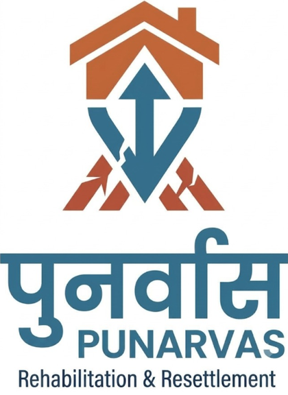

<p align="center">
  
</p>

# PUNARVAS: Rehabilitation & Resettlement

Integrated red zone and relocation planning system. Decision support for identifying landslide-prone villages, prioritising them for relocation, and matching them to resettlement sites. The current build replays the 30 July 2024 landslides at Meppadi, Wayanad.

## Features

- Rainfall trigger slider (stands in for the IMD forecast) with alert levels
- Hazard layers: landslide, flood and cloudburst
- Adjustable priority weights: hazard, exposure, vulnerability, disaster history
- Village ranking into Immediate, Short-term, Medium and Monitor tiers
- Funding slider that matches funded villages to relocation sites and flags those needing a field survey
- Export of the relocation plan as JSON
- Light and dark mode

## Project structure

```
app.py              Streamlit wrapper that embeds the app
index.html          The planning tool (React + MapLibre GL + Tailwind, loaded from CDNs)
requirements.txt    Python dependencies for Streamlit
assets/             Logo and favicon
.streamlit/         Streamlit configuration
```

## Run locally

```bash
python -m venv .venv
source .venv/bin/activate        # Windows: .venv\Scripts\activate
pip install -r requirements.txt
streamlit run app.py
```

You can also open `index.html` directly in a browser. No Python is needed for that.

## Deploy

**Streamlit Community Cloud:** push this repo to GitHub, then at [share.streamlit.io](https://share.streamlit.io) choose *Create app*, select the repo and branch, and set the main file to `app.py`.

**GitHub Pages (static):** in the repo go to *Settings, Pages*, set the source to the `main` branch and root folder. `index.html` is served as the site.

## About the data

Village names, the event and the Elstone Estate township site are real. Coordinates are approximate, and household counts, susceptibility scores and Parcels B and C are indicative placeholders. Not for operational use.
